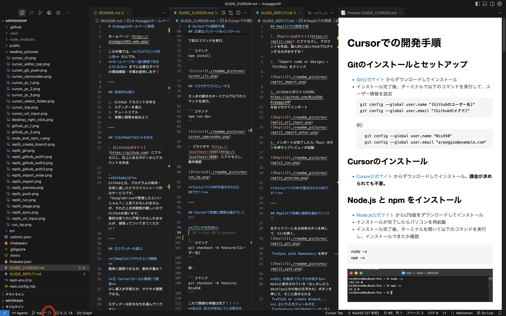
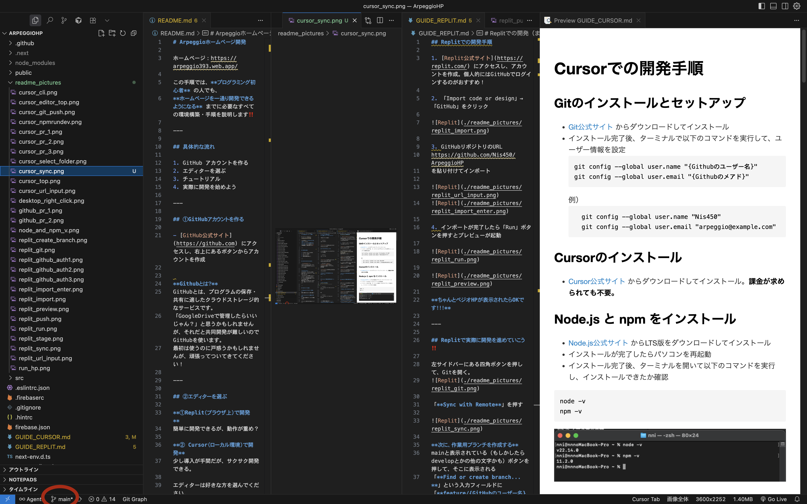
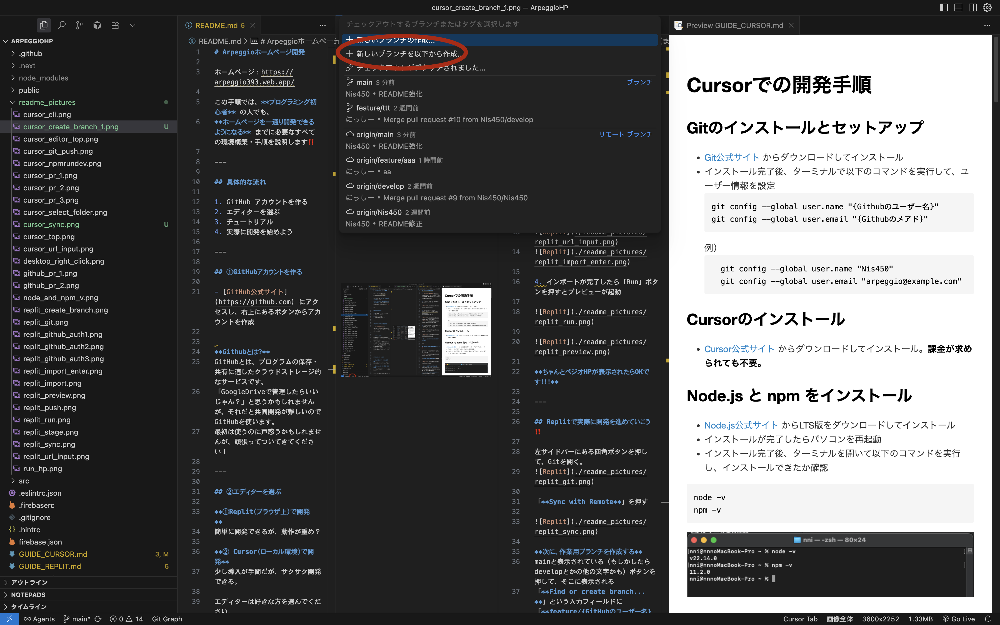
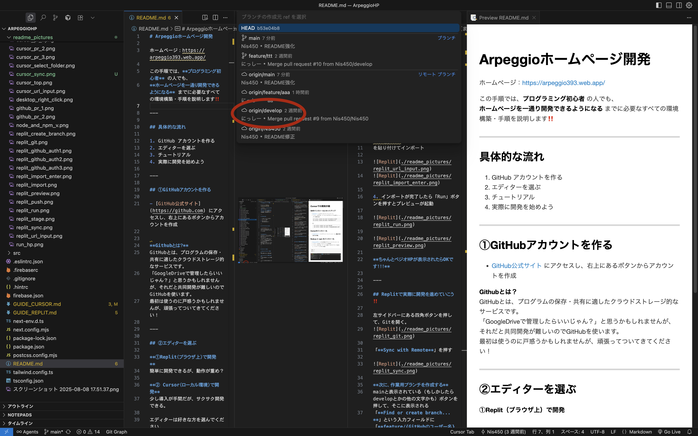
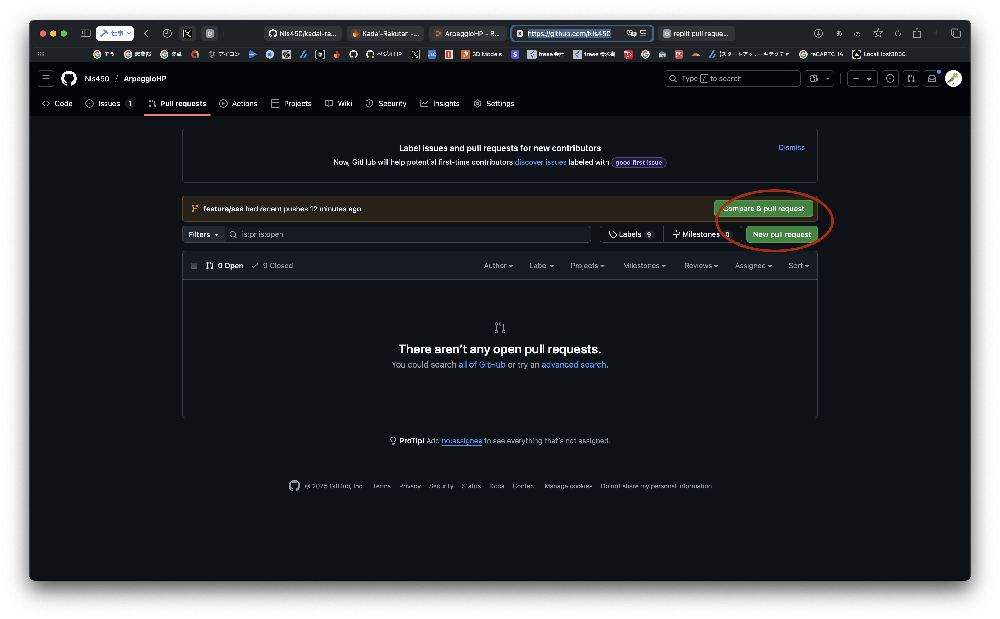
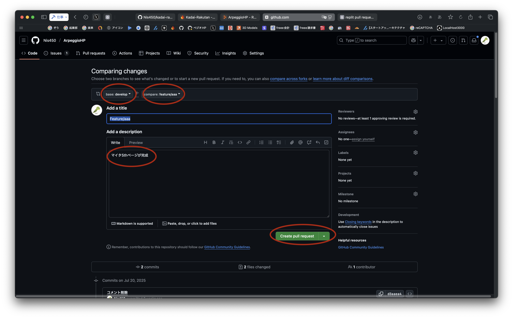

# Cursorでの開発手順

## Gitのインストールとセットアップ

- [Git公式サイト](https://git-scm.com/) からダウンロードしてインストール  
- インストール完了後、ターミナルで以下のコマンドを実行して、ユーザー情報を設定  

  ```コマンド
  git config --global user.name "{Githubのユーザー名}"
  git config --global user.email "{Githubのメアド}"
  ```

  例）

  ```コマンド
    git config --global user.name "Nis450"
    git config --global user.email "arpeggio@example.com"
    ```

## Cursorのインストール

- [Cursor公式サイト](https://cursor.so/) からダウンロードしてインストール。**課金が求められても不要。**

## Node.js と npm をインストール

- [Node.js公式サイト](https://nodejs.org/ja/download) からLTS版をダウンロードしてインストール  
- インストールが完了したらパソコンを再起動
- インストール完了後、ターミナルを開いて以下のコマンドを実行し、インストールできたか確認  

```コマンド
node -v
npm -v
```


もしバージョンが表示されない場合、連絡ください

## GithubからペジオHPのプログラムをダウンロード

1. Cursorを開く
2. Clone repoを押す


上らへんにあるURL欄に

```HPのリンク
https://github.com/Nis450/ArpeggioHP.git 
```

をペーストしてEnter。


適当にフォルダー選んでOK。デスクトップフォルダーが無難かも？


左にファイル一覧が表示されたら準備OK！


ここから先のコマンドは**ペジオHPフォルダを開いているCursor上のターミナル**で実行してください。
左上にターミナルというボタンがあるはず？

## 必要なパッケージをインストール

下記のコマンドを実行。

```コマンド
npm install
```


## ブラウザでプレビューする

さっきの続きのターミナルで以下のコマンドを実行。

```コマンド
npm run dev
```


- ブラウザで [http://localhost:3000](http://localhost:3000) にアクセスし、動作確認  


**ちゃんとペジオHPが表示されたらOKです！！！**

---

## Cursorで実際に開発を進めていこう‼️

Cursorの一番左下にある同期ボタンを押して、最新のデータを取得してください。



**次に、作業用ブランチを作成する**

Cursorの左下にある、mainという文字（もしかしたらdevelopなどの他の文字かも）ボタンを押す



次に、「新しいブランチを以下から作成」というボタンを押す



「origin/develop」というボタンを押す




**ブランチを作成**

```コマンド
git checkout -b feature/{ユーザー名}
```

例：

```コマンド
git checkout -b feature/Nis450
```

これで開発の準備は完了！！！！
**あとは、自分が担当している部分をカタカタ開発しよう！！！！！**

## 開発がひと段落ついたら

Cursorの左上にあるツリーみたいなボタンを押して、作業内容を簡単に入力して、下矢印？のボタンを押して「**コミットしてプッシュ**」を押す。


この操作をすることで、あなたが書いたプログラムがGithubにアップロードされます！
このコミット&プッシュは何回行っても構いません。

例えばアルバム情報追加の場合・・

```コマンド
トラック1の情報を全て追加してとりあえずコミット&プッシュ
トラック2の情報も全て追加してコミット&プッシュ
```

という感じでも問題ありません。

- この際、**初回はパスワードが求められる**ことがあります。その際、**パスワード欄にはPersonal Access Tokenを入力**してください  
  
  ### Personal Access Tokenの作成手順

  1. 以下のURLにアクセス  
     <https://github.com/settings/tokens>
  2. 右上にある「Generate new token (classic)」をクリック  
  3. トークンの名前（例：Arpeggio開発用）と有効期限を設定  
  4. 「repo」にチェックを入れる  
  5. 下までスクロールし、「Generate token」をクリック  
  6. 表示されたトークンをコピーし、**パスワード欄に貼り付ける**

ちなみに...
**コミットプッシュとは？**

自分の作業内容をパソコン上に保存（コミット）し、
それをGitHubにアップロード（プッシュ）することです。  
この作業を行うことで、チーム全体が最新の作業内容を共有できるようになります。

## Pull Request（PR）を作成

Pull Request（PR）とは、各々が開発した内容を管理者（にっしー）に確認・サーバーに反映してもらうための申請のようなものです。  
何回かstage & commit & pushした後に、**担当している機能や内容が完全に完成したら**、PRを出してください。
**開発途中の段階でもstage & commit & pushは何回しても大丈夫ですが、PRは開発途中の段階では出さないようお願いします。**

### 実際にPRを出してみよう

PRを出すためにペジオHPのGitHubにアクセスしてください。

<https://github.com/Nis450/ArpeggioHP/pulls/>

黄色の表示のところに、自分のユーザー名のブランチが表示されている場合、Compare & pull requestを押してください。もし表示されていなければ、New pull requestを押してください。
どっちを押しても大丈夫です



そしてPR画面では、

```注意
baseがdevelopになっているかを確認！もしなっていなければ、developを選択する。
```

そして、

```注意
compareが自分のユーザー名のブランチが表示されているかを確認！もしなっていなければ、自分のユーザー名のブランチを選択する。
```

そして、descriptionに開発した内容や、解決できなかったバグなども簡単に入力。

その後、緑の「**Create pull request**」ボタンを押してください。



以上です！
PRを出したらディスコサーバーで「PR出した」と一声欲しいです！

# Cursorでの開発(まとめ)

## 初期セットアップ（最初の1回だけ）

- GitHubアカウント作成
- Git、Node.js、npmのインストール
- Cursorのインストール
- ペジオHPのコードをGitHubからClone
- 必要なパッケージをインストール（npm install）

## 開発フェーズで毎回行う作業

- 最新データを反映

```コマンド
git pull
```

- 作業用ブランチの作成

```コマンド
git checkout -b feature/{ユーザー名}
```

- コード編集・開発
- コミット & プッシュ（適宜）
- 担当機能完成後にPull Requestの作成
