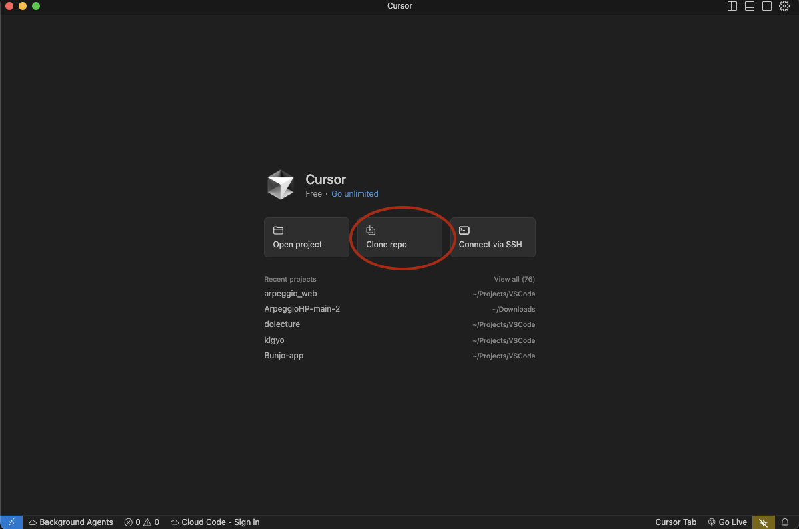
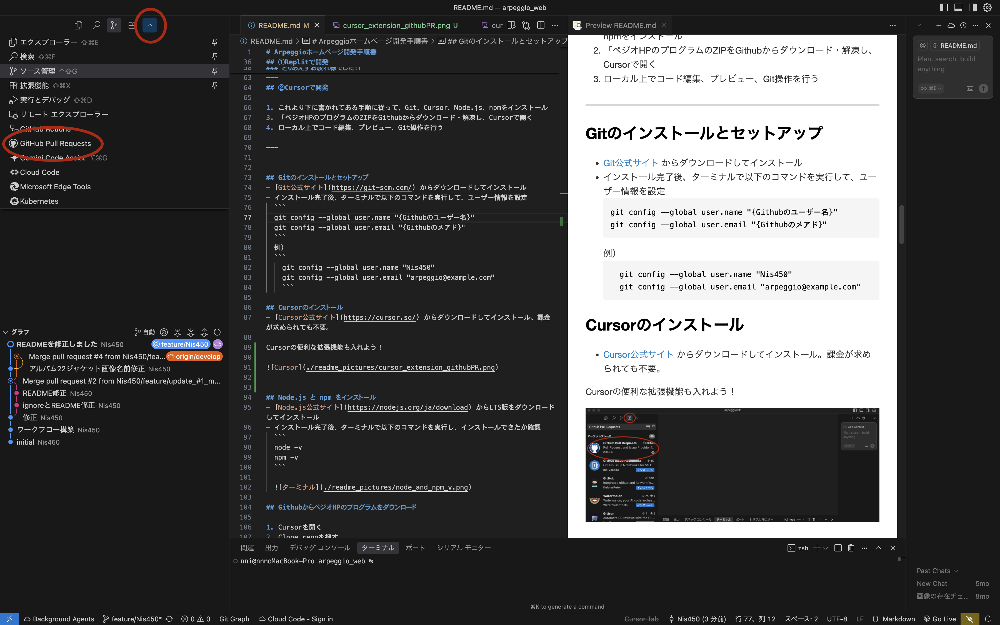
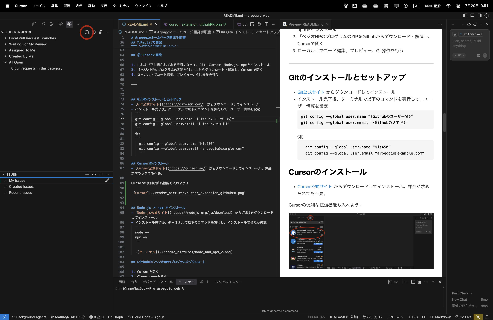

# Cursorでの開発手順

## Gitのインストールとセットアップ
- [Git公式サイト](https://git-scm.com/) からダウンロードしてインストール  
- インストール完了後、ターミナルで以下のコマンドを実行して、ユーザー情報を設定  
  ```
  git config --global user.name "{Githubのユーザー名}"
  git config --global user.email "{Githubのメアド}"
  ```
  例）
  ```
    git config --global user.name "Nis450"
    git config --global user.email "arpeggio@example.com"
    ```

## Cursorのインストール
- [Cursor公式サイト](https://cursor.so/) からダウンロードしてインストール。**課金が求められても不要。**

Cursorの便利な拡張機能も入れよう！

左上にある正方形のボタンを押して、検索欄に
```
GitHub Pull Requests
```
を入力してインストール！


## Node.js と npm をインストール
- [Node.js公式サイト](https://nodejs.org/ja/download) からLTS版をダウンロードしてインストール  
- インストール完了後、ターミナルで以下のコマンドを実行し、インストールできたか確認  
  ```
  node -v
  npm -v
  ```

  

もしバージョンが表示されない場合、連絡ください

## GithubからペジオHPのプログラムをダウンロード

1. Cursorを開く
2. Clone repoを押す




上らへんにあるURL欄に
```
https://github.com/Nis450/ArpeggioHP.git 
```
をペーストしてEnter。


適当にフォルダー選んでOK。デスクトップフォルダーが無難かも？


左にファイル一覧が表示されたら準備OK！


ここから先のコマンドは**ペジオHPフォルダを開いているCursor上のターミナル**で実行してください。
左上にターミナルというボタンがあるはず？


## 必要なパッケージをインストール

下記のコマンドを実行。
```
npm install
```


## ブラウザでプレビューする

さっきの続きのターミナルで以下のコマンドを実行。
```
npm run dev
```


- ブラウザで [http://localhost:3000](http://localhost:3000) にアクセスし、動作確認  


### ちゃんとペジオHPが表示されたらOKです！！！
### とりあえずお疲れ様でした！！

---
## Cursorでの開発フェーズ詳細

## 作業用ブランチを作成
```
git checkout -b feature/{ユーザー名}
```

例：
```
git checkout -b feature/Nis450
```

## 開発‼️
自分が担当している部分のコードをカタカタして開発する。

## 開発がひと段落ついたら

Cursorの左上にあるツリーみたいなボタンを押して、作業内容を簡単に入力して、下矢印？のボタンを押して「**コミットしてプッシュ**」を押す。


この操作をすることで、あなたが書いたプログラムがGithubにアップロードされます！
このコミット&プッシュは何回行っても構いません。

例えばアルバム情報追加の場合・・
```
トラック1の情報を全て追加してとりあえずコミット&プッシュ
トラック2の情報も全て追加してコミット&プッシュ
```
という感じでも問題ありません。

- この際、**初回はパスワードが求められる**ことがあります。その際、**パスワード欄にはPersonal Access Tokenを入力**してください  
  
  ### Personal Access Tokenの作成手順

  1. 以下のURLにアクセス  
     https://github.com/settings/tokens
  2. 右上にある「Generate new token (classic)」をクリック  
  3. トークンの名前（例：Arpeggio開発用）と有効期限を設定  
  4. 「repo」にチェックを入れる  
  5. 下までスクロールし、「Generate token」をクリック  
  6. 表示されたトークンをコピーし、**パスワード欄に貼り付ける**

ちなみに...
**コミットプッシュとは？**

自分の作業内容をパソコン上に保存（コミット）し、
それをGitHubにアップロード（プッシュ）することです。  
この作業を行うことで、チーム全体が最新の作業内容を共有できるようになります。

  
## Pull Request（PR）を作成

Pull Request（PR）とは、自分が作業した内容を管理者に確認・反映してもらうための申請のようなものです。  
何回かコミット＆プッシュした後に、**担当している機能や内容が完全に完成したら**、PRを出してください。
**コミット&プッシュは開発途中の段階でも何回しても大丈夫ですが、PRは開発が完全に完了してから出してください**

 ### 手順:

左上にある下矢印？のボタンを押して、GitHub Pull Requestsを押す


赤丸で示したボタンを押す


BASEが「develop」になっているかを確認！もしなっていなければ、developに書き換える。

そしてMERGEのところは
**feature/{自分のユーザー名}**
になっているかを確認！

OKなら、完成した内容を入力して**Createボタン**を押す！


## お疲れ様でした！！！！！
#### あとは管理者が確認して、バグがあれば修正して、サーバーに反映させます！

完了次第、あなたのブランチは消します！
また新しく担当する場合は、ブランチの作成から始めてください！


# Cursorでの開発（まとめ）

## 初期セットアップ（最初の1回だけ）

- GitHubアカウント作成
- Git、Node.js、npmのインストール
- Cursorのインストール
- ペジオHPのコードをGitHubからClone
- 必要なパッケージをインストール（npm install）

## 開発フェーズで毎回行う作業

- 最新データを反映
``` 
git pull
``` 
- 作業用ブランチの作成
```
git checkout -b feature/{ユーザー名}
```
- コード編集・開発
- コミット & プッシュ（適宜）
- 担当機能完成後にPull Requestの作成