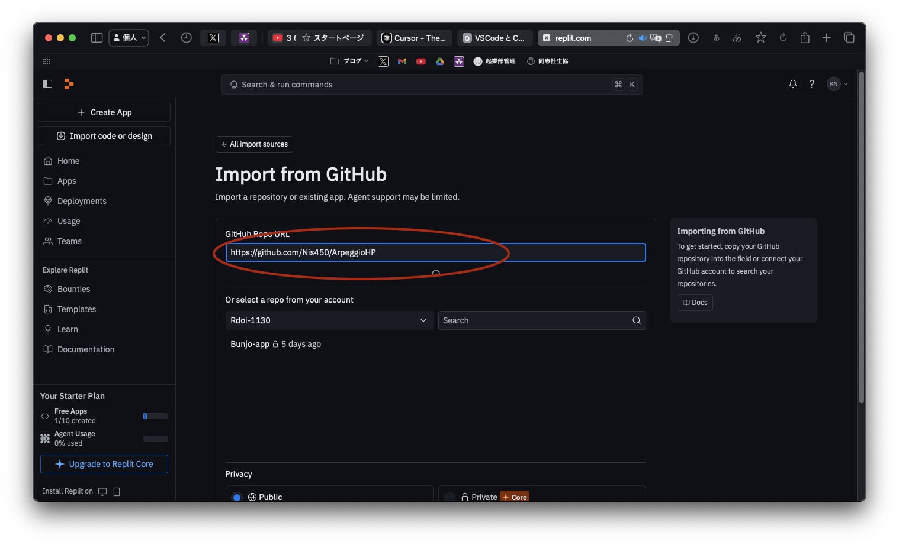
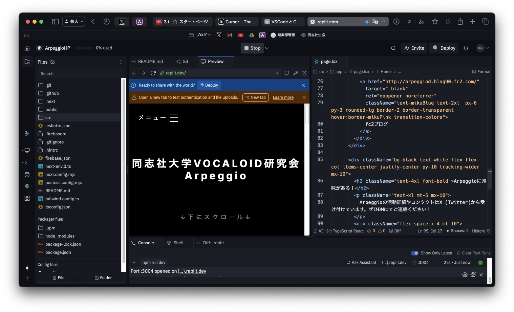

## Replitでの開発手順

1. [Replit公式サイト](https://replit.com/) にアクセスし、アカウントを作成
2. 「Import code or design」→「GitHub」をクリック


3. GitHubリポジトリURL(https://github.com/Nis450/ArpeggioHP)を貼り付けてインポート




4. インポートが完了したら「Run」ボタンを押すとプレビューが起動




5. コード編集・プレビュー・Git操作がすべてブラウザ上で可能

### ちゃんとペジオHPが表示されたらOKです！！！
### とりあえずお疲れ様でした！！


---


## Replitでの開発フェーズ詳細

## 作業用ブランチを作成
左サイドバーにある四角ボタンを押して、Gitを開く。


mainボタンを押して、入力フィールドに「**feature/Nis450**」と入力。そしてCreate Branchボタンを押す。

(写真はNis450だけどfeatureNis450と入力してね)

これで開発の準備は完了。

## 開発
自分が担当している部分のコードをカタカタして開発する。

## 開発がひと段落ついたら

左サイドバーからGitを開いて、作業内容を簡単に入力して、下矢印？のボタンを押して「**Stage and commit all changes**」を押す。


そして、その後、「**Push branch as 'origin/~~'**」のボタンを押す！！忘れずに！！


この操作をすることで、あなたが書いたプログラムがGithubにアップロードされます！
このコミット&プッシュは何回行っても構いません。

例えばアルバム情報追加の場合・・
```
トラック1の情報を全て追加してとりあえずコミット&プッシュ
トラック2の情報も全て追加してコミット&プッシュ
```
という感じでも問題ありません。

- この際、**初回はGitHub認証が求められる**ことがあります。

画面上の指示に従って再認証してください。


All Repositoriesで構いません。
  

ちなみに...
**コミットプッシュとは？**

自分の作業内容をReplit上に保存（コミット）し、
それをGitHubにアップロード（プッシュ）することです。  
この作業を行うことで、チーム全体が最新の作業内容を共有できるようになります。

  
## GitHub上でPull Request（PR）を作成

Pull Request（PR）とは、自分が作業した内容を管理者に確認・反映してもらうための申請のようなものです。  
何回かコミット＆プッシュした後に、**担当している機能や内容が完全に完成したら**、PRを出してください。
**開発途中の段階でもコミットプッシュは何回しても大丈夫ですが、PRは開発途中の段階では出さないようお願いします。**

 ### 手順:
変更内容をペジオHP管理者が確認し、ホームページに反映させます！ 

左上にある下矢印？のボタンを押して、GitHub Pull Requestsを押す


赤丸で示したボタンを押す


BASEが「develop」になっているかを確認！もしなっていなければ、developに書き換える。

そしてMERGEのところは
**feature/{自分のユーザー名}**
になっているかを確認！

OKなら、**Createボタン**を押す！


# Replitでの開発（まとめ）

## 初期セットアップ（最初の1回だけ）

- GitHubアカウント作成
- Replitアカウント作成
- ペジオHPのコードをReplitにインポート

## 開発フェーズで毎回行う作業

- 作業用ブランチの作成
- コード編集・開発
- コミット & プッシュ（適宜）
- 担当機能完成後にPull Requestの作成

以上です！
