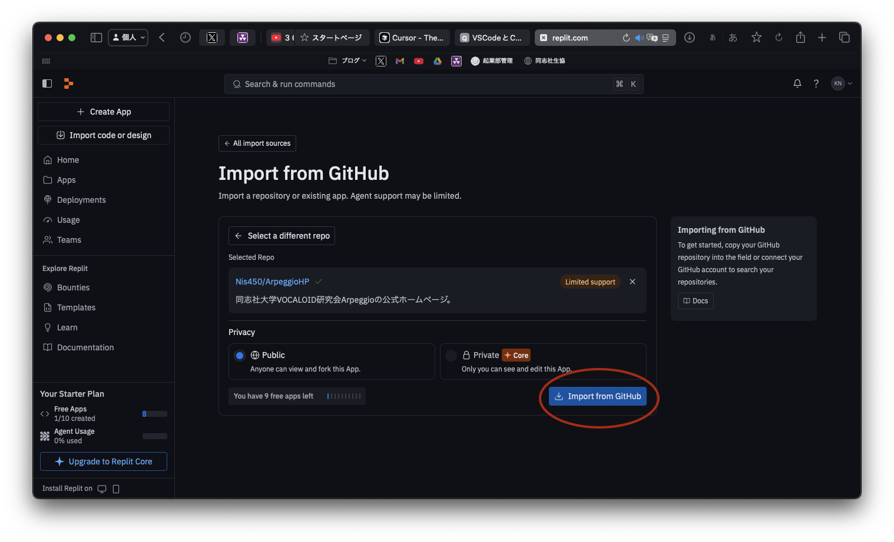
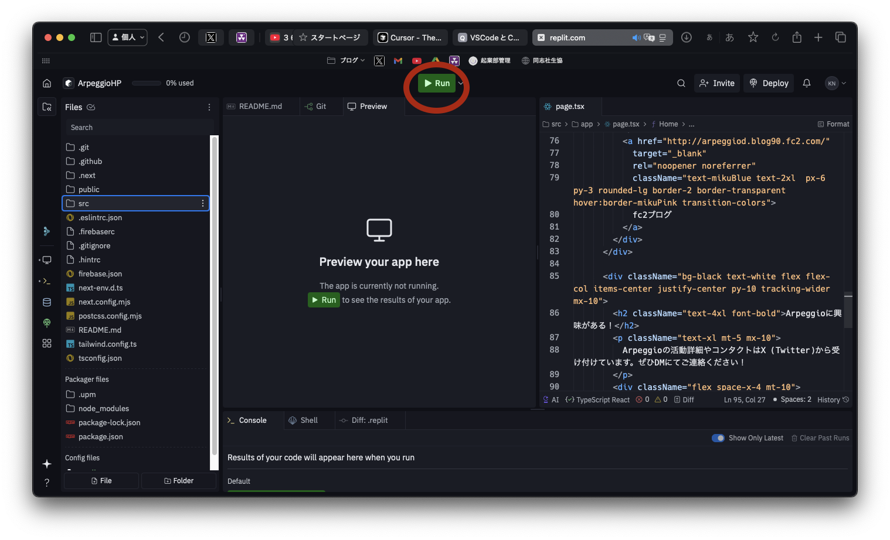
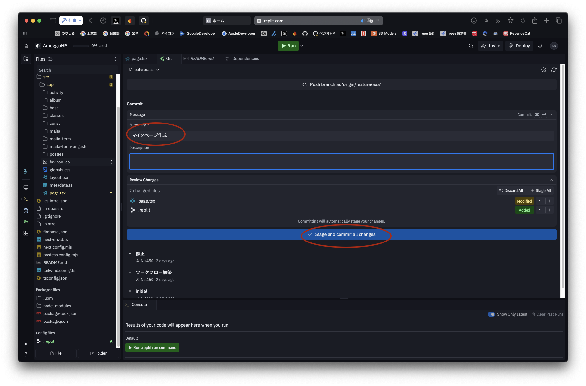
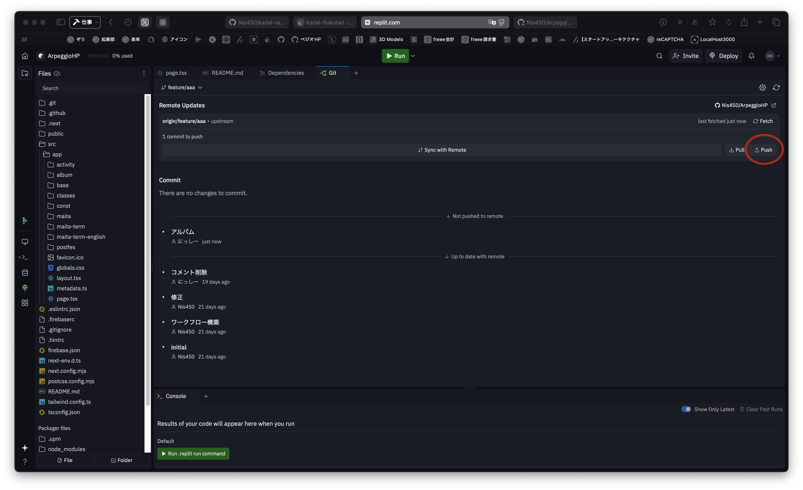
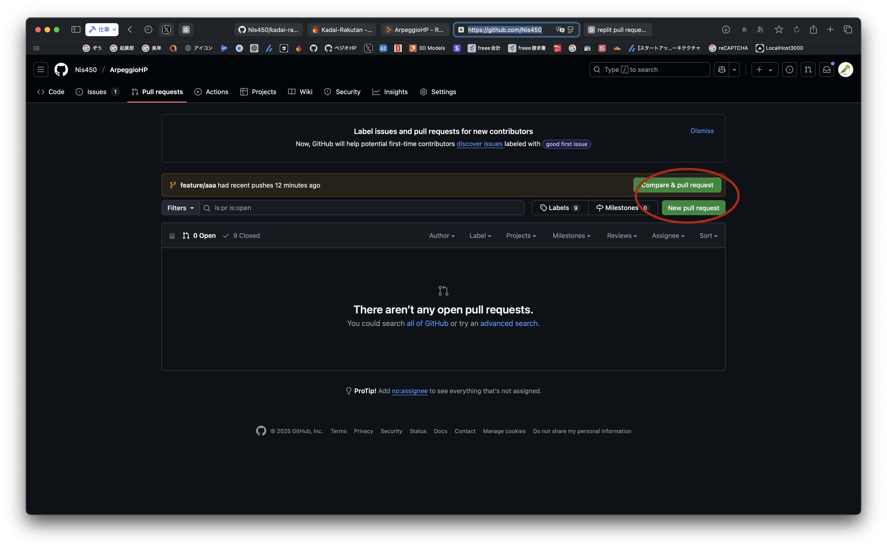

## Replitでの開発手順

1. [Replit公式サイト](https://replit.com/) にアクセスし、アカウントを作成。個人的にはGitHubでログインするのがおすすめ！

2. 「Import code or design」→「GitHub」をクリック


3. GitHubリポジトリのURL
https://github.com/Nis450/ArpeggioHP
を貼り付けてインポート




4. インポートが完了したら「Run」ボタンを押すとプレビューが起動




**ちゃんとペジオHPが表示されたらOKです！！！**

---

## Replitで実際に開発を進めていこう‼️

左サイドバーにある四角ボタンを押して、Gitを開く。


「**Sync with Remote**」を押す


**次に、作業用ブランチを作成する**
mainと表示されている（もしかしたらdevelopとかの他の文字かも）ボタンを押して、そこに表示される
「**Find or create branch...**」という入力フィールドに「**feature/{GitHubのユーザー名}**」と入力。

```入力例
入力例：feature/Nis450
```

そしてCreate Branchボタンを押す。


これで開発の準備は完了！！！！
**あとは、自分が担当している部分をカタカタ開発しよう！！！！！**

---

作業がひと段落ついたら、以下の手順を踏もう（完全に完成する前でOK）

左サイドバーからGitを開いて、Summaryに作業内容を簡単に入力。

```作業内容の入力例
作業内容の入力例：
アルバム34thのトラック1を追加
```

Summaryを入力したら、青いボタン「**Stage and commit all changes**」を押す。



その後、右上にある「**Push**」のボタンを押す！！忘れずに！！



この操作をすることで、あなたが書いたプログラムがGithubにアップロードされます！
このコミット&プッシュは何回行っても構いません。

例えばアルバム情報追加の場合・・

```コミットプッシュの注意点
トラック1の情報を全て追加してstage& commit & pushする
↓
その後にトラック2の情報も全て追加してstage& commit & pushする
```

という感じでも問題ありません。

```コミットプッシュの注意点2
⚠️初めてPushする時、GitHub認証が求められることがあります。
```

画面上の指示に従って再認証してください。

↑の画面で完了する時もあります。


↓の画面ではAll Repositoriesで構いません。その後にinstall Authorizeを押してください。


---

## GitHub上でPull Request（PR）を作成

Pull Request（PR）とは、各々が開発した内容を管理者（にっしー）に確認・サーバーに反映してもらうための申請のようなものです。  
何回かstage & commit & pushした後に、**担当している機能や内容が完全に完成したら**、PRを出してください。
**開発途中の段階でもstage & commit & pushは何回しても大丈夫ですが、PRは開発途中の段階では出さないようお願いします。**

### 実際にPRを出してみよう

PRはReplit上では出せないようなので、ペジオHPのGitHubにアクセスして出してください。

https://github.com/Nis450/ArpeggioHP/pulls/

黄色の表示のところに、自分のユーザー名のブランチが表示されている場合、Compare & pull requestを押してください。もし表示されていなければ、New pull requestを押してください。
どっちを押しても大丈夫です



そしてPR画面では、

```注意
baseがdevelopになっているかを確認！もしなっていなければ、developを選択する。
```

そして、

```注意
compareが自分のユーザー名のブランチが表示されているかを確認！もしなっていなければ、自分のユーザー名のブランチを選択する。
```

そして、descriptionに開発した内容や、解決できなかったバグなども簡単に入力。

その後、緑の「**Create pull request**」ボタンを押してください。


以上です！
PRを出したらディスコサーバーで「PR出した」と一声欲しいです！

# Replitでの開発（まとめ）

## 初期セットアップ（最初の1回だけ）

- GitHubアカウント作成
- GithubアカウントでReplitにログイン
- ペジオHPのコードをReplitにインポート

## 開発フェーズで毎回行う作業

- Sync with Remoteを押す
- feature/{ユーザー名}という名前でブランチの作成
- コード編集・開発
- stage & commit & push（こまめに）

## 完成したら

- GitHubでPull Requestを出す

以上です！
PRが承認されたら、feature/{ユーザー名}のブランチは自動で削除します！
また新しく担当する場合、**開発フェーズで毎回行う作業**(Sync with Remoteを押してブランチ作成するところ)から始めてください！
