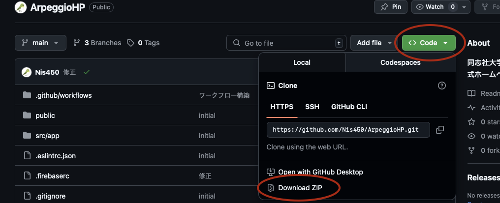

# Arpeggioホームページ開発手順書

ホームページ：https://arpeggio393.web.app/

この手順では、**プログラミング初心者** の人でも、  
**ホームページをアップデートする** までに必要なすべての環境構築・手順を説明します‼️


（後輩のみんなへ）
ペジオHPは過去に何回か制作されてはメンテ不能に陥るなど、色々と困ったことが発生していました...
そこで、この代でそんな困り事は絶対に終わらせる！ということで、先祖代々のペジオHPとは大きく異なる
- 全てプログラムでの開発
- GitHubでのホームページ管理
- Google Cloudでのサーバー構築
という体制を採用しました。なんでそんな複雑な？と思うかもしれませんが、これが一番未来にも残しやすい体制なのです。

## 必須条件
- 理工学部（情シス/イン情）・文化情報学部・同女 学芸学部（メディア創造学科） (それ以外でもプログラミングに触れた経験があれば🙆‍♂️)
- VS CodeまたはCursor、ReplitなどのAIコーディングツールを扱える自信が1mm以上ある
- Githubという名前を知っている

## GitHubアカウントを作る
- [GitHub公式サイト](https://github.com) にアクセスし、右上にあるボタンからアカウントを作成  

## エディターを選ぶ

この開発では、以下の2通りの方法があります。

### ① Replit（ブラウザ上で完結）

- [Replit公式サイト](https://replit.com/) にアクセスし、アカウントを作成
- 「Import from GitHub」からペジオHPのリポジトリ（ https://github.com/Nis450/ArpeggioHP ）を読み込む
- 右上の「Run」ボタンで開発サーバーが起動する
- コード編集・プレビュー・Git操作がすべてブラウザ上で可能
- 特に **プログラミング初心者** におすすめの方法です

### ② VSCode（ローカルで開発）

- まずこのREADMEにある「Gitのインストールとセットアップ」に従ってGitをインストール
- 次に「VSCodeのインストール」に従ってVSCodeをインストール
- その後「GithubからペジオHPのプログラムをダウンロード」に従ってZIPをダウンロード・解凍し、VSCodeで開く
- 以降の作業は、VSCodeのターミナルを使って行ってください


## Gitのインストールとセットアップ
- [Git公式サイト](https://git-scm.com/) からダウンロードしてインストール  
- ターミナルで以下を実行して、ユーザー情報を設定  
  ```
  git config --global user.name "{username}"
  git config --global user.email "{email}"
  ```
  例）
  ```
    git config --global user.name "Nis450"
    git config --global user.email "arpeggio@example.com"
    ```

## VSCodeのインストール
- [VSCode公式サイト](https://code.visualstudio.com/) からダウンロードしてインストール  


## Node.js と npm をインストール
- [Node.js公式サイト](https://nodejs.org/ja/download) からLTS版をダウンロードしてインストール  
- ターミナルで以下を実行し、インストールできたか確認  
  ```
  node -v
  npm -v
  ```

  

## GithubからペジオHPのプログラムをダウンロード

1. [ペジオHPのリポジトリ](https://github.com/Nis450/ArpeggioHP) にアクセス  
2. ページ上部にある緑の「Code」ボタンをクリックし、「Download ZIP」を選択  



3. ダウンロードしたZIPファイルを解凍  
4. 解凍したフォルダを**VSCodeで開く**

ここから先のコマンドは**ペジオHPフォルダを開いているVSCode上のターミナル**で実行してください。

## 必要なパッケージをインストール
```
npm install
```

## Next.js 開発サーバーを起動
```
npm run dev
```
- ブラウザで [http://localhost:3000](http://localhost:3000) にアクセスし、動作確認  


### ちゃんとペジオHPが表示されたらOKです！！！
### とりあえずお疲れ様でした！！

---
# 開発の手順

## 作業用ブランチを作成
```
git checkout -b feature/{ユーザー名}
```

例：
```
git checkout -b feature/Nis450
```

## 開発
自分が担当している部分のコードをカタカタして開発する。

## 変更を保存してコミット
```
git add .
git commit -m "自分が行った変更内容"
```


## 変更をGitHubにプッシュ

```
git push origin feature/{ユーザー名}
```

例：
```
git push origin feature/Nis450
```

- VSCodeのターミナルやソース管理機能からプッシュする際に、**初回はパスワードが求められる**ことがあります。その際、**パスワード欄にはPersonal Access Tokenを入力**してください  
  
  ### Personal Access Tokenの作成手順

  1. 以下のURLにアクセス  
     https://github.com/settings/tokens
  2. 右上にある「Generate new token (classic)」をクリック  
  3. トークンの名前（例：Arpeggio開発用）と有効期限を設定  
  4. 「repo」にチェックを入れる  
  5. 下までスクロールし、「Generate token」をクリック  
  6. 表示されたトークンをコピーし、**VSCodeで求められたパスワード欄に貼り付ける**

  ⚠️ トークンは後から確認できないので、必ずメモしておくこと！
  
## GitHub上でPull Request（PR）を作成
- GitHubのリポジトリページにアクセス  
- 「Compare & Pull Request」ボタンからPRを作成  
- タイトルと説明を記入し、ペジオHP管理者にレビュー依頼 