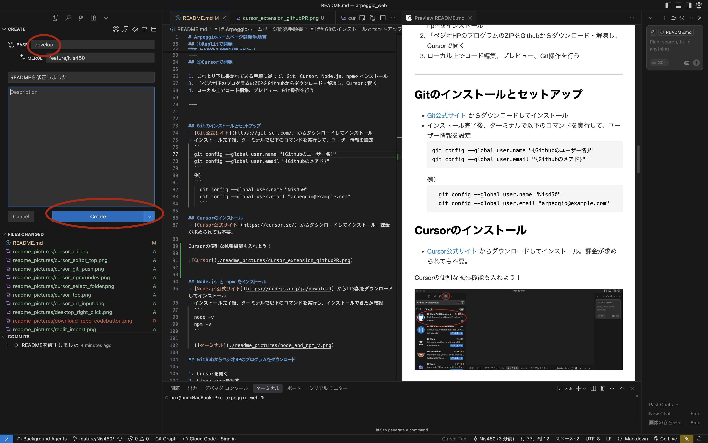

# Arpeggioホームページ開発手順書

ホームページ：https://arpeggio393.web.app/

この手順では、**プログラミング初心者** の人でも、  
**ホームページをアップデートする** までに必要なすべての環境構築・手順を説明します‼️


（後輩のみんなへ）
ペジオHPは過去に何回か制作されてはメンテ不能に陥るなど、色々と困ったことが発生していました...
そこで、この代でそんな困り事は絶対に終わらせる！ということで、先祖代々のペジオHPとは大きく異なる
- 全てプログラムでの開発
- GitHubでのホームページ管理
- Google Cloudでのサーバー構築
という体制を採用しました。なんでそんな複雑な？と思うかもしれませんが、これが一番未来にも残しやすい体制なのです。

## 必須条件
- 理工学部（情シス/イン情）・文化情報学部・同女 学芸学部（メディア創造学科） (それ以外でもプログラミングに触れた経験があれば🙆‍♂️)
- VS CodeまたはCursor、ReplitなどのAIコーディングツールを扱える自信が1mm以上ある
- Githubという名前を知っている

## GitHubアカウントを作る
- [GitHub公式サイト](https://github.com) にアクセスし、右上にあるボタンからアカウントを作成  

## エディターを選ぶ

この開発では、以下の2通りの方法があります。

### ① Replit（ブラウザ上）で開発
簡単に開発できるが、動作が重め？

### ② Cursor（ローカル環境）で開発
少し導入が手間だが、サクサク開発できる

---
## ①Replitで開発

1. [Replit公式サイト](https://replit.com/) にアクセスし、アカウントを作成
2. 「Import code or design」→「GitHub」をクリック


3. GitHubリポジトリURL(https://github.com/Nis450/ArpeggioHP)を貼り付けてインポート


4. インポートが完了したら「Run」ボタンを押すとプレビューが起動


5. コード編集・プレビュー・Git操作がすべてブラウザ上で可能

### ちゃんとペジオHPが表示されたらOKです！！！
### とりあえずお疲れ様でした！！

以下からの内容は、少しがっつり開発を進めたい人向け。
Cursorでの開発方法です。

---
## ②Cursorで開発

1. これより下に書かれてある手順に従って、Git、Cursor、Node.js、npmをインストール
3. 「ペジオHPのプログラムのZIPをGithubからダウンロード・解凍し、Cursorで開く
4. ローカル上でコード編集、プレビュー、Git操作を行う

---


## Gitのインストールとセットアップ
- [Git公式サイト](https://git-scm.com/) からダウンロードしてインストール  
- インストール完了後、ターミナルで以下のコマンドを実行して、ユーザー情報を設定  
  ```
  git config --global user.name "{Githubのユーザー名}"
  git config --global user.email "{Githubのメアド}"
  ```
  例）
  ```
    git config --global user.name "Nis450"
    git config --global user.email "arpeggio@example.com"
    ```

## Cursorのインストール
- [Cursor公式サイト](https://cursor.so/) からダウンロードしてインストール。課金が求められても不要。

Cursorの便利な拡張機能も入れよう！

左上にある2*2正方形のボタンを押して、検索欄に
```
GitHub Pull Requests
```
を入力してインストール！


## Node.js と npm をインストール
- [Node.js公式サイト](https://nodejs.org/ja/download) からLTS版をダウンロードしてインストール  
- インストール完了後、ターミナルで以下のコマンドを実行し、インストールできたか確認  
  ```
  node -v
  npm -v
  ```

  

## GithubからペジオHPのプログラムをダウンロード

1. Cursorを開く
2. Clone repoを押す


上らへんにあるURL欄に
```
https://github.com/Nis450/ArpeggioHP.git 
```
をペーストしてEnter。


適当にフォルダー選んでOK。デスクトップフォルダーが無難かも？


左にファイル一覧が表示されたら準備OK！


ここから先のコマンドは**ペジオHPフォルダを開いているCursor上のターミナル**で実行してください。
左上にターミナルというボタンがあるはず？


## 必要なパッケージをインストール

下記のコマンドを実行。
```
npm install
```


## ブラウザでプレビューする

さっきの続きのターミナルで以下のコマンドを実行。
```
npm run dev
```


- ブラウザで [http://localhost:3000](http://localhost:3000) にアクセスし、動作確認  


### ちゃんとペジオHPが表示されたらOKです！！！
### とりあえずお疲れ様でした！！

---
# 開発の手順

## 作業用ブランチを作成
```
git checkout -b feature/{ユーザー名}
```

例：
```
git checkout -b feature/Nis450
```

## 開発
自分が担当している部分のコードをカタカタして開発する。

## 開発がひと段落ついたら

Cursorの左上にあるツリーみたいなボタンを押して、作業内容を簡単に入力して、下矢印？のボタンを押して「**コミットしてプッシュ**」を押す。


この操作をすることで、あなたが書いたプログラムがGithubにアップロードされます！
このコミット&プッシュは何回行っても構いません。

例えばアルバム情報追加の場合・・
```
トラック1の情報を全て追加してとりあえずコミット&プッシュ
トラック2の情報も全て追加してコミット&プッシュ
```
という感じでも問題ありません。

- この際、**初回はパスワードが求められる**ことがあります。その際、**パスワード欄にはPersonal Access Tokenを入力**してください  
  
  ### Personal Access Tokenの作成手順

  1. 以下のURLにアクセス  
     https://github.com/settings/tokens
  2. 右上にある「Generate new token (classic)」をクリック  
  3. トークンの名前（例：Arpeggio開発用）と有効期限を設定  
  4. 「repo」にチェックを入れる  
  5. 下までスクロールし、「Generate token」をクリック  
  6. 表示されたトークンをコピーし、**Cursorで求められたパスワード欄に貼り付ける**

ちなみに...
**コミットプッシュとは？**

自分の作業内容をパソコン上に保存（コミット）し、
それをGitHubにアップロード（プッシュ）することです。  
この作業を行うことで、チーム全体が最新の作業内容を共有できるようになります。

  
## GitHub上でPull Request（PR）を作成

Pull Request（PR）とは、自分が作業した内容を管理者に確認・反映してもらうための申請のようなものです。  
何回かコミット＆プッシュした後に、**担当している機能や内容が完全に完成したら**、PRを出してください。
**開発途中の段階でもコミットプッシュは何回しても大丈夫ですが、PRは開発途中の段階では出さないようお願いします。**

 ### 手順:
変更内容をペジオHP管理者が確認し、ホームページに反映させます！ 

左上にある下矢印？のボタンを押して、GitHub Pull Requestsを押す


赤丸で示したボタンを押す


BASEが「develop」になっているかを確認！もしなっていなければ、developに書き換える。

そしてMERGEのところは
**feature/{自分のユーザー名}**
になっているかを確認！

OKなら、**Createボタン**を押す！

